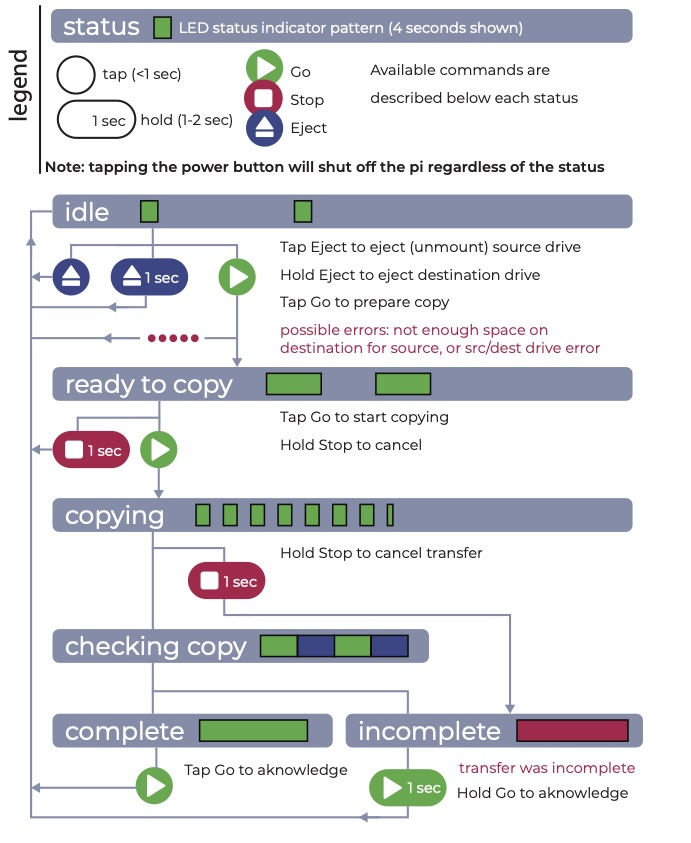
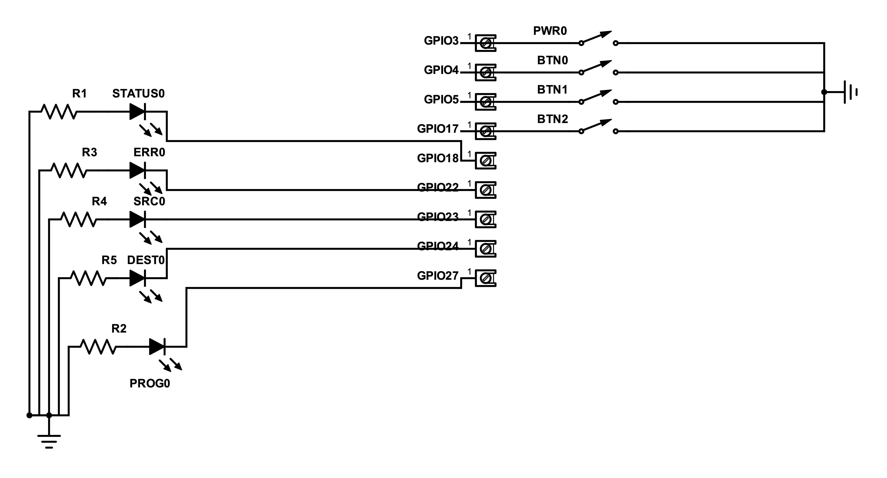

# picopy
Copy sd cards to to a hard drive on Raspberry Pi-based Swallow devices

## Using Swallows to copy SD cards
Swallows are raspberry pi-based devices that copy SD card content to a hard drive. This document explains how to use Swallows to copy SD card content to a hard drive. It assumes the Swallows are fully set up, so that picopy.py runs on boot. 

The Swallow always has a “status” which indicates the current mode of operation. The LEDs indicate the current status of the Swallow. The flow chart may be all you need to understand how to use Swallows. (Just make sure your destination drive has a .picopydest file, and don’t disconnect drives without ejecting them first) 

## LEDs: 
**Status** (green): reports the current status

**Progress** (blue): during copying, reports the progress out of 10 based on the total size of the transfer. For instance, if the transfer is between 10 and 20% complete by size, the light blinks 2 times in a row every ~4 seconds. 

**Error** (red): this light blinks to report errors (See [Errors and Troubleshooting](#errors-and-troubleshooting) below)

**Source** (white): this light is on when a source drive (such as an SD card) is mounted.

**Dest** (white): this light is on when a destination drive is mounted. A destination drive is any USB drive with a `.picopydest` file in its root directory. 

## Buttons: 
There are four buttons and two types of button presses: a tap (<1 sec) and a hold (1-3 sec)

**Go**: used to prepare and start transfers

**Stop**: used to interrupt copying tasks

**Eject**: used to eject (unmount) drives. A tap ejects src drive, a hold ejects dest drive. 

**Power**: power on and off the pi (this will immediately cancel any copying task!)

# Detailed Instructions

## Set-Up
1. If you are using a new “destination” hard drive (the hard drive to which you will copy data): Plug the “destination drive” into a computer. In the top-level directory of that drive, make a file called `.picopydest` (in terminal, `touch .picopydest`). 

2. attach the Swallow and hard drive to their power supplies

3. attach source (SD card) and destination drives to the USB 3 (Blue) ports

4. check that drives are mounted (src and dest LEDs light up)

## Copy Files
The flow chart above shows how each of the buttons can be used depending on the current status. 

The typical workflow without interruptions or errors is:
1. Tap “Go” to prepare a transfer 
- Checks if source and destination are available
- status changes from “idle” to “ready to copy”
2. Tap “Go” again to start the transfer
- Status changes from “ready to copy” to “copying”
- wait for it to finish (blue LED indicates progress as # flashes/10)
- Status changes from “copying” to “checking copy”
- Status changes from “checking copy” to “complete”
3. Tap “Go” again to acknowledge the completed transfer

## After copying
1. Eject the source (tap eject button) and destination (hold eject button) drives
- The src and dest LEDs should turn off
- It is now safe to unplug the drives from USB ports
2. Power off the pi by tapping the power button

# Errors and Troubleshooting

### Steady red light: incomplete transfer
This means the data was not completely transferred to the destination; the rsync process failed to finish or was interrupted
Hold the Go button to acknowledge the incomplete transfer and return to “idle”

### 3-blink error: source drive
- Check that the src LED is on. If it is not, no source drive is mounted (or multiple possible source drives are mounted). (A source drive is any external USB drive that does not have .picopydest in its root folder)
- Make sure there aren’t multiple source drives mounted
- Unmount then unplug all USB devices and start over
- Power off the pi and start over

### 4-blink error: dest drive
- Check that the dest LED is on. If it is not, no destination drive is mounted. (A destination drive is any external USB drive that has .picopydest in its root folder)
- Make sure there aren’t multiple destination drives mounted
- Unmount then unplug all USB devices and start over
- Power off the pi and start over

### 5-blink error: insf space
-  There is not enough space on the destination for the contents of the source. Use a destination drive with more space
-  If you believe there should be enough space, check for large .Trashes and remove the trash if desired

### General debugging: 
- ssh into the raspberry pi from a computer
- Open the log files located in /usr/bin/picopy.out to read the output of the copying script

### schematic for Pi-HAT

### SSH into pi with Ethernet cable
If you connect an ethernet cable directly to a Raspberry Pi, you can SSH in (provided SSH is enabled, `ssh` file exists in `~`) with:

`ssh user@hostname.local`

for instance,

`ssh pi@raspberry.local` for unchanged hostname, or

`ssh pi@swallow-001.local` if the hostname was changed to `swallow-001`

This allows you to view, manipulate, and debug files and programs on the Swallow. 
