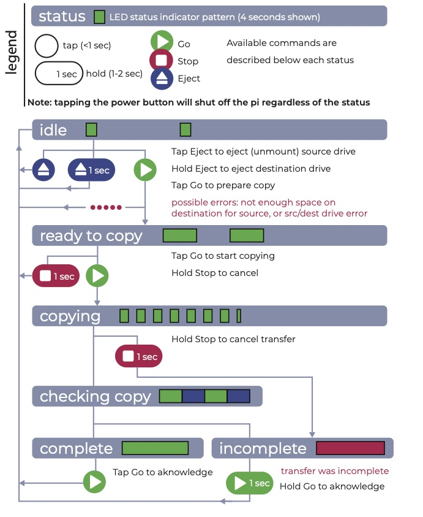
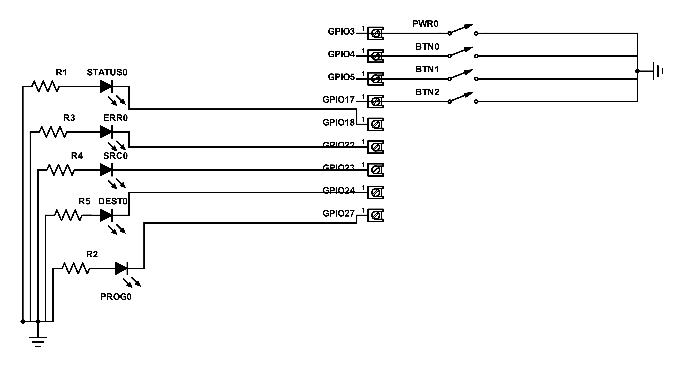

# picopy
Copy sd cards to to a hard drive on Raspberry Pi-based Swallow devices

Navigation:

[Copying Cards: Detailed Instructions](#detailed-instructions-for-copying-cards)

[Setting up the Swallow](#initial-swallow-set-up)

[Debugging](#debugging)

[Updating](#updating)


## Using Swallows to copy SD cards
Swallows are raspberry pi-based devices that copy SD card content to a hard drive. This document explains how to use Swallows to copy SD card content to a hard drive. It assumes the Swallows are fully set up, so that picopy.py runs on boot. 
The Swallow always has a “status” which indicates the current mode of operation. The LEDs indicate the current status of the Swallow. The flow chart may be all you need to understand how to use Swallows. (Just make sure your destination drive has a file or folder named `PICOPY_DESTINATION`, and don’t disconnect drives without ejecting them first!)



> Note: if the Swallow is offline and is disconnected then reconnected to power, it will not have the correct internal date and time. 

## LEDs: 
**Status** (green): reports the current status

**Progress** (blue): during copying, reports the progress out of 10 based on the total size of the transfer. For instance, if the transfer is between 10 and 20% complete by size, the light blinks 2 times in a row every ~4 seconds. 

**Error** (red): this light blinks to report errors (See [Errors and Troubleshooting](#errors-and-troubleshooting) below)

**Source** (white): this light is on when a source drive (such as an SD card) is mounted.

**Dest** (white): this light is on when a destination drive is mounted. A destination drive is any USB drive with a file or folder named `PICOPY_DESTINATION` in its root directory. 

## Shutting down the device
Turning the device off requires you to hold the power button for 3 seconds. If any external drives are mounted, the device will not shut down. When the device shuts down, the small LEDS on the green board will turn off. Wait at least 15 seconds before unplugging the power cable. 

## Buttons: 
There are four buttons and two types of button presses: a tap (<1 sec) and a hold (1-3 sec)

Buttons:

**Run**: used to prepare and start transfers

**Stop**: used to interrupt copying tasks

**Eject**: used to eject (unmount) drives. A tap ejects src drive, a hold ejects dest drive. 

**Power**: power on and off the pi (this will immediately cancel any copying task!)

# Detailed Instructions for copying cards

## Set-Up Card Copying
1. If you are using a new “destination” hard drive (the hard drive to which you will copy data): Plug the “destination drive” into a computer. In the top-level directory of that drive, make a folder called `PICOPY_DESTINATION`. This is not where the data will be copied to, its presence simply signals to the Swallow that this drive should be used as a destination rather than source for data copying.  

2. attach the Swallow and hard drive to their power supplies

3. attach source (SD card) and destination drives to the USB 3 (Blue) ports

4. check that drives are mounted (src and dest LEDs light up)

## Copy Files
The flow chart above shows how each of the buttons can be used depending on the current status. 

The typical workflow without interruptions or errors is:
1. Tap Run to prepare a transfer 
- Checks if source and destination are available
- status changes from “idle” to “ready to copy”
2. Tap Run again to start the transfer
- Status changes from “ready to copy” to “copying”
- wait for it to finish (blue LED indicates progress as # flashes/10)
- Status changes from “copying” to “checking copy”
- Status changes from “checking copy” to “complete”
3. Tap Run again to acknowledge the completed transfer

## After copying
1. Eject the source (tap eject button) and destination (hold eject button) drives
- The src and dest LEDs should turn off
- It is now safe to unplug the drives from USB ports
2. If desired, power off the device by holding the power button for 3 seconds

## Errors and Troubleshooting during card copy

### Steady red light: incomplete transfer
This means the data was not completely transferred to the destination; the rsync process failed to finish or was interrupted
Hold the Run button to acknowledge the incomplete transfer and return to “idle”

### 3-blink error: source drive
- Check that the src LED is on. If it is not, no source drive is mounted (or multiple possible source drives are mounted). (A source drive is any external USB drive that does not have a file or folder named `PICOPY_DESTINATION` in its root folder)
- Make sure there aren’t multiple source drives mounted
- Unmount then unplug all USB devices and start over
- Power off the pi and start over

### 4-blink error: dest drive
- Check that the dest LED is on. If it is not, no destination drive is mounted. (A destination drive is any external USB drive that has a file or folder named `PICOPY_DESTINATION` in its root folder)
- Make sure there aren’t multiple destination drives mounted
- Unmount then unplug all USB devices and start over
- Power off the pi and start over

### 5-blink error: insf space
-  There is not enough space on the destination for the contents of the source. Use a destination drive with more space
-  If you believe there should be enough space, check for large .Trashes and remove the trash if desired

### 6-blink error: bad files on source drive
-  Unable to access source drive and read disk space. Likely caused by corrupted files on drive.
-  Recommended to inspect source drive and, if desired, copy accessible files between drives manually through the terminal or on another device.

### 10 rapid blinks of red Error LED:
- User attempted to shut down the swallow, but there are external drives mounted. Shutdown will not occur. Unmount all drives before shutting down.

### Blue, Green, and Red LEDs flash 5 times slowly together:
- The device is shutting down

### General debugging: 
See detailed debugging info below at [Debugging](#debugging)

### schematic for Pi-HAT


### SSH into pi with Ethernet cable
If you connect an ethernet cable directly to a Raspberry Pi, you can SSH in (provided SSH is enabled, `ssh` file exists in `~`) with:

`ssh user@hostname.local`

for instance,

`ssh pi@raspberry.local` for unchanged hostname, or

`ssh pi@swallow-001.local` if the hostname was changed to `swallow-001`

This allows you to view, manipulate, and debug files and programs on the Swallow. 

# Initial Swallow Set up

Setting up a Raspberry Pi 4.0 to use as a Swallow

### Operating system
- flash SD card with raspberry pi OS using Raspberry PI [Imager](https://www.raspberrypi.com/software/) application. 

> Choose the latest 64 Bit Raspberry Pi OS and select the attached SD card as the drive

- use the set-up features in the application to:
  - set the country/location
  - set the host-name (swallow-016, eg)
  - enter wifi credentials for a local wifi network. 
  - enable SSH (password authentication) 
  - set username ("pi" is good) and password
 
Note: if setting up multiple swallows, can re-use the settings but need to re-enter the wifi password, login password, and modify the host-name

### IP and SSH
- SSH into the pi: `ssh pi@[hostname].local`, password: whatever you set during imaging

- Get MAC address for the ETH0 ethernet port: from Pi's command line interface, run

`ip link show` 

and Serial Number:

`cat /proc/cpuinfo | grep Serial`

- write MAC address and serial number in a logging spreadsheet for your reference

- Expand file system to use entire SD card

`sudo raspi-config > advanced > expand filesystem`

- reboot to realize the new file system space

> Previously had to install exfat file system support, but this is now packaged in Raspberry Pi OS

### Set up the picopy python script

- requires internet connection (should automatically be on wifi network provided during set up)
- move to ~ (default user) directory, clone picopy from github, and install: 
 
```
cd
git clone https://github.com/sammlapp/picopy.git
sudo sh ./picopy/script/install.sh
```

The install script creates a copy of picopy in startup applications and sets it up to run as an executable on startup. 

### test hardware
- stop picopy and listen-for-shutdown to avoid competition for GPIO

```
sudo systemctl stop listen-for-shutdown.service
sudo systemctl stop picopy.service
```

- run test script on pi: 
`python3 /home/pi/picopy/test_leds_buttons.py`
- all leds will light up if they are working properly
- check that all buttons work by pushing each button (should see text logged in console for each button)
- use ctrl+C to exit

> we previously used https://github.com/sammlapp/pi-power-button.git for power on/off, but now the power button is also controlled within the picopy program. This avoids GPIO conflicts. 

- Reboot with `sudo reboot -h now` then check that it starts picopy (flashes green light 'ready' status) and recognizes an external exFat drive (source/dest drive LED lights up)

# Debugging 
Infor for debugging Raspberry Pi connectivity and setup

Picopy logs all messages to /var/log/picopy.log
- consider deleting this file every once in a while (eg once per year) since it will continually grow in size

Connect swallow directly to laptop with ethernet
SSH using `ssh pi@[hostname].local` and enter password

can manually set up wifi via: `sudo raspi-config` -> System Options -> Wilreless LAN -> enter network name and password

can stop the python processes with:
```
sudo systemctl stop listen-for-shutdown.service
sudo systemctl stop picopy.service
```

if you need to kill a process directly (eg picopy.py)
```
sudo htop
F4 to filter -> type picopy
F9 to kill -> 9 key -> enter
```

To run the button testing script:
```
cd ~/picopy
python3 test_leds_buttons.py
```

# Updating
To update pycopy with any changes from the GitHub repository:

If the swallow is connected to the internet, you can pull changes from the GitHub picopy repository:
```
cd ~/picopy
git pull
sudo sh ./script/uninstall.sh
sudo sh ./script/install.sh
```

If connected via ethernet to a laptop, first pull changes to your laptop:
```
cd ~/picopy
git pull
```

Then sync them to the swallow:
```
rsync -r ~/picopy/ pi@swallow-038.local:~/picopy/
```

then, on the swallow, uninstall and reinstall
```
cd ~/picopy
sudo sh ./script/uninstall.sh
sudo sh ./script/install.sh
```
